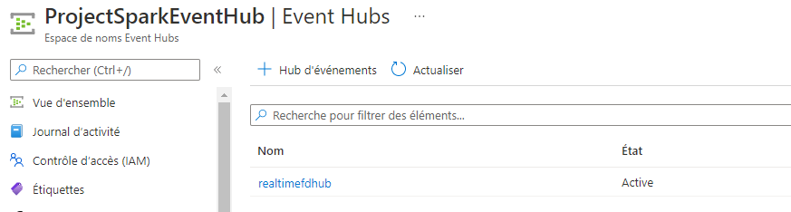
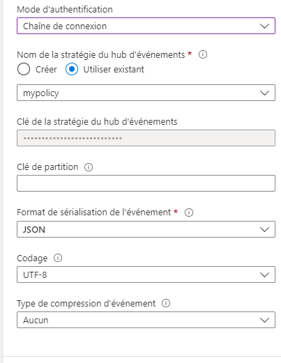
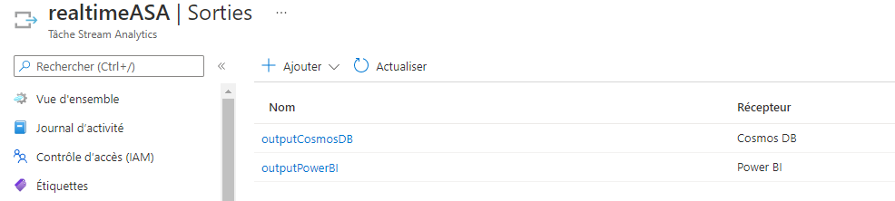
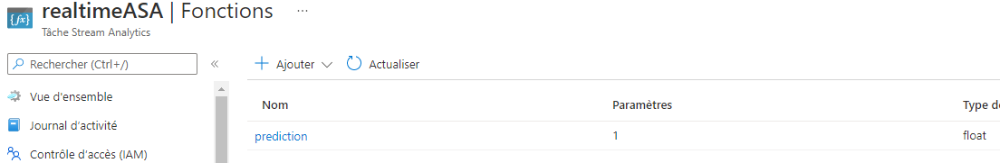
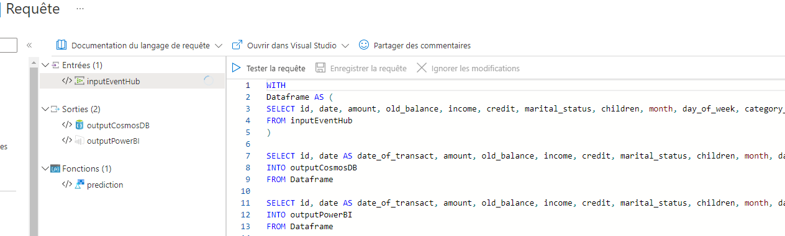

# Real-Time-Project-Azure

## Contenu
- [Introduction à l'architecture et approche globale](https://github.com/Katalyse/Real-Time-Project-Azure/blob/main/README.md#1-introduction-%C3%A0-larchitecture-et-approche-globale)
- [Architecture technique détaillée](https://github.com/Katalyse/Real-Time-Project-Azure/blob/main/README.md#2-architecture-technique-d%C3%A9taill%C3%A9e)
- [Développement du générateur](https://github.com/Katalyse/Real-Time-Project-Azure#3-d%C3%A9veloppement-du-g%C3%A9n%C3%A9rateur)
- [Paramétrage des services Event Hub et Azure Stream Analytics puis liaison des services](https://github.com/Katalyse/Real-Time-Project-Azure#4-param%C3%A9trage-des-services-event-hub-et-azure-stream-analytics-puis-liaison-des-services)
- [Envoie de données du générateur vers le service Event Hub ](https://github.com/Katalyse/Real-Time-Project-Azure#5-envoie-de-donn%C3%A9es-du-g%C3%A9n%C3%A9rateur-vers-le-service-event-hub)
- [Mise en place d’une Azure Cosmos DB puis liaison avec Stream Analytics et création d’un historique de données](https://github.com/Katalyse/Real-Time-Project-Azure#6-mise-en-place-dune-azure-cosmos-db-puis-liaison-avec-stream-analytics-et-cr%C3%A9ation-dun-historique-de-donn%C3%A9es)
- [Développement de l’algorithme de ML avec Spark et enregistrement du modèle sous Azure ML](https://github.com/Katalyse/Real-Time-Project-Azure#7-d%C3%A9veloppement-de-lalgorithme-de-ml-avec-spark-et-enregistrement-du-mod%C3%A8le-sous-azure-ml)
- [Déploiement du modèle de ML dans un conteneur Azure Kubernetes](https://github.com/Katalyse/Real-Time-Project-Azure#8-d%C3%A9ploiement-du-mod%C3%A8le-de-ml-dans-un-conteneur-azure-kubernetes)
- [Mise en place d’un Event Hub / Azure Stream Analytics / Azure Cosmos DB pour l’architecture finale en temps réel](https://github.com/Katalyse/Real-Time-Project-Azure#9-mise-en-place-dun-event-hub--azure-stream-analytics--azure-cosmos-db-pour-larchitecture-finale-en-temps-r%C3%A9el)
- [Création et intégration des deux dashboards Power BI](https://github.com/Katalyse/Real-Time-Project-Azure#10-cr%C3%A9ation-et-int%C3%A9gration-des-deux-dashboards-power-bi)


# 1. Introduction à l'architecture et approche globale

<p align="justify">
L’objectif de ce projet est de créer une architecture cloud permettant d'analyser des données en temps réel. Plus précisément, nous disposons de données provenant de transactions bancaires qu'il faut traiter pour savoir si une transaction est frauduleuse ou non. Il faut pour cela s’appuyer sur une architecture qui va permettre de stocker, d’analyser et de restituer les données le plus rapidement possible. La notion de rapidité est primordiale pour répondre un tel cas d'utilisation. Il faut aussi tenir compte du volume potentiel de données à ingérer en temps réel. Pour ces raisons, nous allons s'appuyer sur le service Azure Stream Analytics. Aussi, nous disposons d'un volume de données conséquent pour développer l'algorithme de Machine Learning ce qui implique que nous utiliserons un cluster Spark avec Azure Synapse Analytics pour réaliser cette tâche. 
</p>

<p align="justify">
Voyons l’architecture mise en place pour répondre à ces problématiques :
</p>


# 2. Architecture technique détaillée

<p align="justify">
Pour ce projet, nous disposons d’un générateur de données en local. Il est donc chargé de simuler des transactions bancaires et d’envoyer des requêtes contenant ces données vers le service Event Hub. Dans la première partie de cette architecture, on va construire un historique des transactions pour pouvoir créer un modèle de machine learning. Le service Event Hub capture les événements provenant du générateur. Les données sont transmises vers le service Azure Stream Analytics qui redirige les données vers une base de données Azure Cosmos DB permettant de stocker des documents au format JSON. Une fois que l’on dispose de plusieurs dizaines de milliers d’enregistrement, on va pouvoir créer notre modèle de ML. On utilisera un environnement Spark sur Azure Synapse Analytics pour réaliser cette tâche. L’utilisation d’un cluster Spark permet de créer des algorithmes de ML à partir d’un grand volume de données de manière rapide. Une fois que le modèle est construit, il est enregistré dans Azure Machine Learning pour qu’il soit facilement déployable. On va créer un conteneur Azure Kubernetes pour héberger le modèle. Une fois que l’on dispose du modèle dans un conteneur, on peut mettre en place la deuxième partie de l’architecture qui va permettre le traitement des données en temps réel. 
</p>

<p align="justify">
Le générateur va envoyer un certain nombre de données vers le service Event Hub. Cette fois-ci, les données ne sont pas labelisées et l’algorithme doit prédire si la transaction est frauduleuse ou non. Une architecture lambda est mise en place au niveau du service de streaming d’Azure. En effet, le service Event Hub est chargé de recueillir les événements envoyés depuis le générateur puis va transmettre ces événements vers le service Azure Stream Analytics. Dans un premier temps, ce dernier envoie les données vers le conteneur Kubernetes pour les scorer à l’aide de l’algorithme de machine learning. Le service Azure Stream Analytics récupère la prédiction puis envoie les données à la fois vers Power BI et vers Azure Cosmos DB. Le rapport Power Bi permet d’obtenir un visuel en temps réel pour repérer des transactions frauduleuses et Azure Cosmos DB permet de stocker toutes ces données. Enfin, un autre rapport Power BI est créé à partir de l’historique des transactions stockées dans Azure Cosmos DB.
</p>

<p align="justify">
La première partie de l'architecture sert à créer un historique de données pour développer l'algorithme de ML. La deuxième est celle utilisée en condition réelle. Des données sont reçues aléatoirement dans le temps. Nous devons déterminer si ces données décrivent une transaction frauduleuse ou non. Il faut aussi stocker ces données pour les conserver et les restituer. Voyons maintenant étape par étape la construction de cette architecture. On note que toutes les ressources de ce projet se situent dans le même groupe de ressource sous Azure.
</p>

# 3. Développement du générateur

<p align="justify">
Pour construire le générateur de données, on choisit le pourcentage de transaction frauduleuse (10% ici) puis on va générer des valeurs aléatoires pour chaque variable en fonction de si la transaction est frauduleuse ou non. On ajoute du bruit et de la variabilité dans les données pour complexifier le travail du futur algorithme. Nous avons différentes variables comme le montant de la transaction, la balance sur le compte, les revenus, les crédits, le statut marital, le nombre d'enfants, le jour et le mois de la transaction, le type de transaction ou encore la méthode de paiement. Pour chaque transaction, on crée un dictionnaire Python contenant chacune des variables avec une valeur. On transformera par la suite ce dictionnaire en document JSON que l'on enverra vers l'architecture Azure. Voyons maintenant le développement de cette architecture.
</p>

# 4. Paramétrage des services Event Hub et Azure Stream Analytics puis liaison des services

<p align="justify">
On commence par créer une ressource Event Hub puis un Event Hub au sein de la ressource. Il suffit d'attribuer un nom et un nombre de partitions. 
</p>
 
  

<p align="justify">
Il faut ensuite définir une stratégie d'accès partagé afin d'établir une connexion avec Azure Streaming Analytics. Pour cela, on se rend dans l'Event Hub que l'on vient de créer puis on ajoute une stratégie d'accès partagé en attribuant un nom et les autorisations "Gérer", "Envoyer" et "Ecouter". 
</p>

<p align="justify">
On crée ensuite une ressource Stream Analytics Job. Ce service consiste à définir trois éléments : l'entrée, la requête et la sortie. Il peut y avoir plusieurs entrées et sorties. L'entrée consiste à créer une connexion avec un service qui va envoyer les données. La sortie permet de définir les ressources qui vont recevoir les données. La requête permet de modifier, de transformer ou d'agréger les données. Nous disposons de données provenant d'un Event Hub, il faut donc définir cette ressource comme entrée de notre service Azure Streaming Analytics.   
</p>

<p align="justify">
Pour cela, on ajoute une entrée de flux de type Event Hub dans l'onglet "Entrées". On définit ensuite un alias puis on cherche la ressource Event Hub que l'on vient de créer. On ajoute aussi la stratégie d'Event Hub que l'on a créé ci-dessous et qui se nomme "mypolicy". On précise la forme de stockage des données (JSON dans mon cas).
Nous avons maintenant une connexion effective entre nos services Event Hub et Stream Analytics.   
</p>



<p align="justify">
Voyons maintenant comment envoyer les données vers le service Event Hub.
</p>

# 5. Envoie de données du générateur vers le service Event Hub

<p align="justify">
Nous souhaitons envoyer chacun des dictionnaires Python générés vers le service Event Hub sous la forme d'un document JSON. On va donc envoyer une requête POST vers le service Event Hub. Avant cela, nous devons sécuriser la connexion entre le générateur et le service Event Hub. Nous allons donc inscrire une application dans Azure Active Directory. Nous attribuons le rôle d'expéditeur de données à notre application AAD au sein d'Event Hub (onglet Contrôle d'accès IAM). Nous pouvons maintenant demander un token d'authentification auprès d'Azure Active Directory qui nous permettra dans un second temps d'envoyer des données à Event Hub de manière securisée et en étant authentifié. On fait donc une première requête pour récupérer le token AAD (il faut au préalable créer une clé secrète dans AAD) puis on peut envoyer les documents JSON vers le service Event Hub.
</p>

```Python
print(json_dict)
    
#Obtain AAD Token
url = "https://login.microsoftonline.com/253bb4e8-8e40-4739-9b26-c2d5d2ea2d04/oauth2/token"
    
payload={'grant_type': 'client_credentials',
    'client_id': '16927c99-1ce9-460e-9c9c-e2b693a53315',
    'client_secret': '*************************************',
    'resource': 'https://eventhubs.azure.net'}
    
headers = {
      'Content-Type': 'application/x-www-form-urlencoded',
      'Cookie': 'fpc=AtYw0mDu1vlPg3bhIy1YMobw1pLaAQAAAKONstkOAAAA; stsservicecookie=estsfd; x-ms-gateway-slice=estsfd'
}
    
response = requests.request("GET", url, headers=headers, data=payload)
    
access_token = json.loads(response.text)["access_token"]
    
#hub = "eventhubspark"
hub = "realtimefdhub" 
    
#Send data to event hub
url = "https://ProjectSparkEventHub.servicebus.windows.net/" + hub + "/messages?partitionId=1"
    
headers = {
      'Content-Type': 'application/atom+xml;type=entry;charset=utf-8',
      'Authorization': 'Bearer' + ' ' + access_token
}
    
response = requests.request("POST", url, headers=headers, data=str(json_dict))

print("successfully transferred !!!")
```

<p align="justify">
La connexion est en place. Lorsque nous exécutons le générateur, il va envoyer des transactions vers le service Event Hub qui va les rediriger vers Azure Stream Analytics. Il faut maintenant définir une sortie pour notre service de streaming.
</p>

# 6. Mise en place d’une Azure Cosmos DB puis liaison avec Stream Analytics et Création d’un historique de données

<p align="justify">
Nous utiliserons Azure Cosmos DB qui permet de stocker des données de type document en JSON. D'autres solutions de stockage sont possibles. On crée un service Azure Cosmos DB avec l'API core (SQL). On crée ensuite un conteneur.
</p>


<p align="justify">
Etablissons la connexion entre Azure Cosmos DB et Azure Stream Analytics. Pour cela, on retourne au niveau du service de streaming dans l'onglet "Sorties". On ajoute une sortie de type Comos DB. On précise la base de données et le conteneur que l'on vient de créer.
</p>


<p align="justify">
Nous avons désormais notre entrée et notre sortie pour le service Azure Stream Analytics, il suffit de terminer par l'écriture de la requête. Ici, nous n'avons pas besoin de transformer les données, nous pouvons les envoyer directement vers Azure Comos DB puisqu'elles sont dans le bon format. Nous utilisons la requête la plus simple possible consistant à prendre toutes les données de l'entrée et les envoyer vers la sortie.
</p>


<p align="justify">
Nous avons maintenant effectué la connexion entre le générateur et Cosmos DB en passant par Event Hub et Azure Streaming Analytics. Il est possible d'envoyer directement les données du générateur vers Cosmos DB. Cependant, nous allons réutiliser l'architecture Event Hub / Streaming Analytics dans la suite et nous verrons en quoi c'est utile et pertinent pour obtenir une architecture scalable et performante. Nous envoyons des dizaines de milliers de transactions du générateur vers Comos DB et nous pouvons voir ci-dessous que les données arrivent bien jusqu'à notre base de données Cosmos DB.
</p>


# 7. Développement de l’algorithme de ML avec Spark et enregistrement du modèle sous Azure ML

<p align="justify">
Nous pouvons désormais créer notre modèle de Machine Learning visant à prédire si une transaction est frauduleuse ou non. Nous disposons de données labelisées dans Cosmos DB afin d'entrainer l'algorithme. Nous créons un service Azure Synapse Analytics permettant d'accéder à un environnement de travail Spark. Au sein d'Azure Synapse, nous créons un service lié avec Azure Cosmos DB pour avoir facilement l'accès aux données. Nous ouvrons un notebook sur le pool Spark et nous pouvons commencer le développement de l'algorithme. On commence par importer les données et les afficher.
</p>

```Python
df = spark.read\
    .format("cosmos.olap")\
    .option("spark.synapse.linkedService", "LinkServiceCosmosDB")\
    .option("spark.cosmos.container", "container-fraud-detection")\
    .load()

display(df.limit(10))
```

<p align="justify">
Après avoir visualisé les données, on crée un pipeline pyspark contenant l'ensemble des étapes de processing des données et le modèle final. On applique un encodage one hot sur une partie des variable, un encodage de type label encoder sur une autre variable, une standardisation des variables continues et nous n'appliquons aucune transformation sur quelques-unes des variables. C'est un modèle de gradient boosting. On note que l'optimisation de l'algorithme n'est pas une étape primordiale de ce PoC puisque ce sont des données générées artificiellement.
</p>

```Python
continuous_column = ['amount', 'old_balance', 'income']
ohe_column = ['month', 'day_of_week', 'category_recipient', 'transaction_method']
le_column = 'transaction_type'
other_column = ['credit', 'marital_status', 'children', 'foreign_transaction']

stages = []

indexer = StringIndexer(inputCol=le_column, outputCol= le_column + "_LE")
stages += [indexer]

for catCol in ohe_column:
    stringIndexer = StringIndexer(inputCol = catCol, outputCol = catCol + '_LE')
    encoder = OneHotEncoder(
        inputCols=[stringIndexer.getOutputCol()], 
        outputCols=[catCol + "_OHE"]
    )
    stages += [stringIndexer, encoder]

assemblerScaler = VectorAssembler(inputCols=continuous_column, outputCol="feature_SS")
stages += [assemblerScaler]

standardizer = StandardScaler().setInputCol("feature_SS").setOutputCol("feature_SS2")
stages += [standardizer]

assemblerInputs = [oc + "_OHE" for oc in ohe_column] + [le_column + "_LE"] + ["feature_SS2"] + other_column
assembler = VectorAssembler(inputCols=assemblerInputs, outputCol="features")

stages += [assembler]

#rf = RandomForestClassifier(featuresCol = 'features', labelCol = 'isFraud', numTrees=1000)
rf = GBTClassifier(featuresCol = 'features', labelCol = 'isFraud', maxIter=100)

stages += [rf]

print(stages)
```

<p align="justify">
On effectue l'entrainement du modèle, la prédiction sur la base d'entrainement pour avoir une idée de la pertinence et des performances de l'algorithme puis nous sauvegardons notre modèle de machine learning.
</p>

```Python
pipeline = Pipeline(stages = stages)
model = pipeline.fit(train)
predictions = model.transform(test)

pred = predictions.selectExpr("cast(prediction as long) pred","isFraud")
#display(pred)
pred.printSchema()

pandas_pred = pred.toPandas()

from sklearn.metrics import accuracy_score, confusion_matrix

print(accuracy_score(pandas_pred['isFraud'], pandas_pred['pred']))

print(confusion_matrix(pandas_pred['isFraud'], pandas_pred['pred']))

model.save("https://datalakesparkproject.blob.core.windows.net/containerdatalakesparkproject/SparkModelFraudDetection")
```

<p align="justify">
Notre modèle est maintenant entrainé et enregistré, nous pouvons l'inscrire dans un espace de travail Azure Machine Learning que l'on crée au préalable. L'utilisation d'Azure Machine Learning va simplifier le processus d'industrialisation de l'algorithme.
</p>

# 8. Déploiement du modèle de ML dans un conteneur Azure Kubernetes

<p align="justify">
L'objectif des parties 7 et 8 est de mettre en place une fonctionnalité puissante d’Azure Stream Analytics : le scoring d’un algorithme de Machine Learning. En effet, dans des scénarios avancés d’analyse en temps réel, il est parfois nécessaire de faire appel à un algorithme de machine learning pour scorer des nouvelles données de manière rapide. Azure Stream Analytics est un service qui permet d’ingérer des données en temps réel à partir d’événements, de transformer ces données et de les rediriger vers une sortie pour du stockage par exemple. L’avantage majeur qu’offre le service Azure Stream Analytics et que l’on peut scorer les données pendant le processus de transformation. Ceci implique que l’on peut faire des prédictions avant qu’elles soient stockées, ce qui améliore grandement la vitesse de traitement des données et convient donc parfaitement à un scénario d’analyse en temps réel.
</p>

<p align="justify">
Pour mettre en place cette fonctionnalité, il faut créer un conteneur AKS hébergeant le modèle de Machine Learning et mettre en place l’appel de ce conteneur au sein d’Azure Stream Analytics. Plus précisement, deux points sont essentiels : bien définir les entrées et les sorties du script de scoring qui sera appelé dans le conteneur AKS et créer la requête SQL au niveau d’Azure Streaming Analytics qui est en adéquation avec le script de scoring.
</p>

<p align="justify">
Commençons par la création du conteneur AKS avec notre modèle de Machine Learning. Nous travaillons à partir d’un espace de travail Azure Machine Learning dans lequel notre modèle est enregistré. Il faut d’abord effectuer les étapes classiques de la création d’un service web (Déployer des modèles Machine Learning - Azure Machine Learning | Microsoft Docs). On commence par importer l’espace de travail puis on stocke dans une variable notre modèle préalablement enregistré et notre cluster d’inférence que l’on a créé directement sur le studio AML. 
</p>

```Python
from azureml.core import Workspace

ws = Workspace.from_config()
```

```Python
from azureml.core.compute import AksCompute
from azureml.core.model import Model

aks_target = AksCompute(ws, "My-Kub-Inf")
model1 = ws.models["Fraud_Detect_Model"]
```

<p align="justify">
On crée également un fichier au format YAML contenant les packages à installer sur la cible d’inférence avec leurs versions correspondantes. On note qu’il faut ajouter le package ‘inference-schema’ dont on aura besoin par la suite.
</p>

```Yaml
name: project_environment
dependencies:
  # The python interpreter version.
  # Currently Azure ML only supports 3.5.2 and later.
- python=3.6.2

- pip:
    # Required packages for AzureML execution, history, and data preparation.
  - azureml-defaults

  - inference-schema
- scikit-learn=0.22.1
- xgboost==1.2.0
- pandas==1.0.3
- numpy
- joblib
channels:
- anaconda
- conda-forge
```

<p align="justify">
Avant de déployer le modèle sur le conteneur AKS, il faut créer le script de scoring avec les deux fonctions obligatoires ( init() et run() ). Ce script sera exécuté à chaque fois qu’on fera appel au conteneur AKS. La fonction init() doit charger le modèle de Machine Learning. La fonction run() permet d’appliquer le modèle aux nouvelles données. En plus de cela, il faut préciser un exemple d’entrée et de sortie pour le script. Cela va permettre une génération automatique d’un schéma Swagger. Nous utilisons des fonctions du package ‘inference-schema’ pour cela. Nous précisons que nous allons envoyer un DataFrame Pandas en entrée et nous fournissons un exemple. Nous souhaitons recevoir un object Numpy en sortie. Dans la fonction run(), le paramètre data est un donc un Dataframe Pandas et nous devons retourner une liste qui sera transformée en objet numpy puisqu’on l’a précisé dans le schéma de sortie. Cette étape est indispensable pour la mise en place du modèle via Azure Stream Analytics.
</p>

```Python
import json
import os
import pandas as pd
import numpy as np
from xgboost import XGBClassifier
from sklearn.compose import ColumnTransformer
from sklearn.pipeline import Pipeline
from sklearn.preprocessing import OneHotEncoder
from sklearn.preprocessing import StandardScaler
from sklearn.preprocessing import OrdinalEncoder
import joblib

from inference_schema.schema_decorators import input_schema, output_schema
from inference_schema.parameter_types.numpy_parameter_type import NumpyParameterType
from inference_schema.parameter_types.pandas_parameter_type import PandasParameterType

def init():
    global model_pipe
    model_pipe = joblib.load(os.path.join(os.getenv("AZUREML_MODEL_DIR"), "PipeFraudDetection.pkl"))


input_sample = pd.DataFrame(data = [{'id': 45, 'date' : "abc", 'amount': 95.55, 'old_balance': 142590.743, 
          'income': 2979.713, 'credit': 0, 'marital_status': 1, 'children': 2, 
          'month': 10, 'day_of_week': 'monday', 'category_recipient': 'food_store', 
          'transaction_type': 'onsite', 'transaction_method': 'other', 'foreign_transaction': 1}])
output_sample = np.array([1.0])

@input_schema('data', PandasParameterType(input_sample))
@output_schema(NumpyParameterType(output_sample))

def run(data):
    data.drop(['id','date'], axis=1, inplace = True)
    pred = model_pipe.predict(data)
    return pred.tolist()
```

<p align="justify">
Nous pouvons maintenant déployer le modèle et précisant une configuration d’inférence et de déploiement pour notre cible d’inférence. 
</p>

```Python
from azureml.core.webservice import AciWebservice
from azureml.core.webservice import AksWebservice
from azureml.core.model import InferenceConfig
from azureml.core import Model

# Configure the scoring environment
inference_config = InferenceConfig(runtime= "python",
                                   entry_script=script_file,
                                   conda_file=env_file)

deployment_config = AciWebservice.deploy_configuration(cpu_cores = 0.1, memory_gb = 0.5, auth_enabled = False)

service_name = "rt-fd-ml-scoring"

service = Model.deploy(ws, service_name, [model1], inference_config, deployment_config, aks_target)

service.wait_for_deployment(True)
print(service.state)
```

<p align="justify">
Une fois que le service est « healthy », nous pouvons le tester. Pour cela, il faut que les données parviennent au format JSON (comme d’habitude) mais elles doivent respecter une certaine structure pour être en adéquation avec le schéma d’entrée que l’on vient de paramétrer. Par conséquence, pour que le service puisse créer un Dataframe Pandas à partir des données que nous lui envoyons, il faut que la valeur du document JSON soit un tableau contenant un ensemble de paires nom/valeur. On note aussi que le paramètre d’entrée de la fonction run() du script de scoring doit correspondre au nom de l’objet JSON que nous transmettons (ici c’est le nom « data »).
</p>

```Python
import json

x_new = {
    "data": [{'id': 4, 'date' : 'yo', 'amount': 95.55648880442871, 'old_balance': 142590.44432050743, 
          'income': 2979.7136940079527, 'credit': 0, 'marital_status': 1, 'children': 2, 
          'month': 10, 'day_of_week': 'monday', 'category_recipient': 'food_store', 
          'transaction_type': 'onsite', 'transaction_method': 'other', 'foreign_transaction': 1}
    ]
}

input_json = json.dumps(x_new)

predictions = service.run(input_data = input_json)

print(predictions)
```

<p align="justify">
Notre conteneur AKS parvient à scorer correctement les données. Maintenant qu’il fonctionne parfaitement, nous allons configurer le service Azure Stream Analytics pour qu’il puisse appeler le conteneur et scorer les nouvelles données que reçoit le service de streaming.
</p>

# 9. Mise en place d’un Event Hub / Azure Stream Analytics / Azure Cosmos DB pour l’architecture finale en temps réel

Nous souaitons mettre en place la partie real time de l'architecture. Nous disposons déjà de notre conteneur AKS hébergeant le modèle de Machine Learning. Il suffit de reprendre les étapes 4, 5 et 6 présentés ci-dessus pour mettre en place les services Event Hub, Streaming Analytics et Cosmos DB. On peut aussi réutiliser directement ces services en modifiant quelques points. Il faut connecter ces services entre eux. Nous avons désormais notre générateur qui envoie des données à prédire vers le service Event Hub qui les redirige vers le service Azure Streaming Analytics. Ce service va scorer les données puis les envoyer vers le service Comos DB et vers Power BI. Pour cela, il faut disposer d'un espace de travail Power BI puis l'ajouter en tant que sortie du job de streaming.



<p align="justify">
Mettons maintenant en place l'appel du conteneur et l'envoie des résultats vers Power BI et Cosmos DB. Au niveau du service Azure Stream Analytics, on crée une nouvelle fonction de type Azure ML Service. On choisit un nom pour cette nouvelle fonction et on précise l’espace de travail Azure ML avec lequel on a déployé notre conteneur AKS. Azure Stream va automatiquement trouver les points de terminaison disponible et va générer la signature de fonction de manière automatique grâce aux exemples fournis dans le script de scroing. On peut ensuite enregistrer la fonction.
</p>


<p align="justify">
Voici notre fonction prédiction. Il ne manque plus qu’à utiliser cette fonction dans la requête SQL d’Azure Stream Analytics.
</p>



<p align="justify">
Dans la première partie de cette requête nous créons une variable nommée Dataframe à partir de la source de données en entrée. Ce dataframe contient exactement les mêmes colonnes avec les mêmes noms et le même ordre que l’exemple que nous avons spécifié dans le script de scoring. Dans la suite, nous appelons la fonction prédiction en transmettant le Dataframe en paramètre de cette fonction. Nous redirigeons les résultats vers nos deux sorties.
</p>



<p align="justify">
La fonctionnalité de scoring d’un algorithme de Machine Learning au sein d’Azure Stream Analytics est maintenant mise en place. Nous pouvons envoyer des données vers ce service qui va automatiquement appeler le conteneur AKS contenant l’algorithme de ML et envoyer les données scorées vers les services spécifiés en sortie.
</p>

<p align="justify">
Notons que les types que nous avons utilisés en entrée et en sortie ne sont pas les seuls. Nous pouvons par exemple transmettre un Dataframe Spark directement en entrée de la fonction run(). Pour cela, il suffit de changer l’exemple de l’input dans le script de scoring. La requête SQL reste inchangée. Nous pouvons aussi récupérer un array numpy en entrée du script. Il faut pour cela changer l’input dans le script de scoring et passer par une fonction UDF javascript au niveau de la requête SQL. Nous avons un exemple disponible à la fin de la page suivante : Intégration d’Azure Stream Analytics avec Azure Machine Learning | Microsoft Docs. Le Dataframe et l’Array sont les deux types les plus couramment utilisés pour transmettre les données depuis Azure Stream Analytics vers le conteneur AKS hébergeant notre modèle. Nous pouvons aussi utiliser un conteneur ACI.
</p>

# 10. Création et intégration des deux dashboards Power BI

