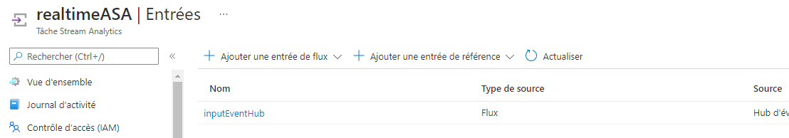

# Real-Time-Project-Azure

## Contenu
- [Introduction à l'architecture et approche globale](https://github.com/Katalyse/Real-Time-Project-Azure/blob/main/README.md#1-introduction-%C3%A0-larchitecture-et-approche-globale)
- [Architecture technique détaillée](https://github.com/Katalyse/Real-Time-Project-Azure/blob/main/README.md#2-architecture-technique-d%C3%A9taill%C3%A9e)
- [Création des services Event Hub et Azure Stream Analytics puis liaison des services](https://github.com/Katalyse/Real-Time-Project-Azure/blob/main/README.md#3-cr%C3%A9ation-des-services-event-hub-et-azure-stream-analytics-puis-liaison-des-services)
- [Développement du générateur et envoie de données du générateur vers le service Event Hub ](https://github.com/Katalyse/Real-Time-Project-Azure/blob/main/README.md#4-d%C3%A9veloppement-du-g%C3%A9n%C3%A9rateur-et-envoie-de-donn%C3%A9es-du-g%C3%A9n%C3%A9rateur-vers-le-service-event-hub)
- [Mise en place d’une Azure Cosmos DB puis liaison avec Stream Analytics et création d’un historique de données](https://github.com/Katalyse/Real-Time-Project-Azure/blob/main/README.md#5-mise-en-place-dune-azure-cosmos-db-puis-liaison-avec-stream-analytics-et-cr%C3%A9ation-dun-historique-de-donn%C3%A9es)
- [Développement de l’algorithme de ML avec Spark et enregistrement du modèle sous Azure ML](https://github.com/Katalyse/Real-Time-Project-Azure/blob/main/README.md#6-d%C3%A9veloppement-de-lalgorithme-de-ml-avec-spark-et-enregistrement-du-mod%C3%A8le-sous-azure-ml)
- [Mise en place d’un Event Hub / Azure Stream Analytics / Azure Cosmos DB pour l’architecture finale en temps réel](https://github.com/Katalyse/Real-Time-Project-Azure/blob/main/README.md#7-mise-en-place-dun-event-hub--azure-stream-analytics--azure-cosmos-db-pour-larchitecture-finale-en-temps-r%C3%A9el)
- [Déploiement du modèle de ML dans un conteneur Azure Kubernetes](https://github.com/Katalyse/Real-Time-Project-Azure/blob/main/README.md#8-d%C3%A9ploiement-du-mod%C3%A8le-de-ml-dans-un-conteneur-azure-kubernetes)
- [Modification de la requete SQL Stream Analytics pour scorer les données](https://github.com/Katalyse/Real-Time-Project-Azure/blob/main/README.md#9-modification-de-la-requete-sql-stream-analytics-pour-scorer-les-donn%C3%A9es)
- [Création et intégration des deux dashboards Power BI](https://github.com/Katalyse/Real-Time-Project-Azure/blob/main/README.md#10-cr%C3%A9ation-et-int%C3%A9gration-des-deux-dashboards-power-bi)


# 1. Introduction à l'architecture et approche globale

<p align="justify">
L’objectif de ce projet est de créer une architecture cloud permettant d'analyser des données en temps réel. Plus précisément, nous disposons de données provenant de transactions bancaires qu'il faut traiter pour savoir si une transaction est frauduleuse ou non. Il faut pour cela s’appuyer sur une architecture qui va permettre de stocker, d’analyser et de restituer les données le plus rapidement possible. La notion de rapidité est primordiale pour répondre un tel cas d'utilisation. Il faut aussi tenir compte du volume potentiel de données à ingérer en temps réel. Pour ces raions, nous allons s'appuyer sur le service Azure Stream Analytics. Aussi, nous disposons d'un volume de données conséquent pour développer l'algorithme de Machine Learning ce qui implique que nous utiliserons un cluster Spark avec Azure Synapse Analytics pour réaliser cette tâche. 
</p>

<p align="justify">
Voyons l’architecture mise en place pour répondre à ces problématiques :
</p>


# 2. Architecture technique détaillée

<p align="justify">
Pour ce projet, nous disposons d’un générateur de données en local. Il est donc chargé de simuler des transactions bancaires et d’envoyer des requêtes contenant ces données vers le service Event Hub. Dans la première partie de cette architecture, on va construire un historique des transactions pour pouvoir créer un modèle de machine learning. Le service Event Hub capture les événements provenant du générateur. Les données sont labelisées dans cette partie de l'architecture (pour construire le modèle). Les données sont transmises vers le service Azure Stream Analytics qui redirige les données vers une base de données Azure Cosmos DB permettant de stocker des documents au format JSON. Une fois que l’on dispose de plusieurs dizaines de milliers d’enregistrement, on va pouvoir créer notre modèle de ML. On utilisera un environnement Spark sur Azure Synapse Analytics pour réaliser cette tâche. L’utilisation d’un cluster Spark permet de créer des algorithmes de ML à partir d’un grand volume de données de manière rapide. Une fois que le modèle est construit, il est enregistré dans Azure Machine Learning pour qu’il soit facilement déployable. On va créer un conteneur Azure Kubernetes pour héberger le modèle. Une fois que l’on dispose du modèle dans un conteneur, on peut mettre en place la deuxième partie de l’architecture qui va permettre le traitement des données en temps réel. 
</p>

<p align="justify">
Le générateur va envoyer un certain nombre de données vers le service Event Hub. Cette fois-ci, les données ne sont pas labelisées et l’algorithme doit prédire si la transaction est frauduleuse ou non. Une architecture lambda est mise en place au niveau du service de streaming d’Azure. En effet, le service Event Hub est chargé de recueillir les événements envoyés depuis le générateur puis va transmettre ces événements vers le service Azure Stream Analytics. Dans un premier temps, ce dernier envoie les données vers le conteneur Kubernetes pour les scorer à l’aide de l’algorithme de machine learning. Le service Azure Stream Analytics récupère la prédiction puis envoie les données à la fois vers Power BI et vers Azure Cosmos DB. Le rapport Power Bi permet d’obtenir un visuel en temps réel pour repérer des transactions frauduleuses et Azure Cosmos DB permet de stocker toutes ces données. Enfin, un autre rapport Power BI est créé à partir de l’historique des transactions stockées dans Azure Cosmos DB.
</p>

<p align="justify">
La première partie de l'architecture sert à créer un historique de données pour développer l'algorithme de ML. La deuxième est celle utilisée en condition réelle. Des données sont reçues aléatoirement dans le temps. Nous devons déterminer si ces données décrivent une transaction frauduleuse ou non. Il faut aussi stocker ces données pour les conserver et les restituer. Voyons maintenant étape par étape la construction de cette architecture.
</p>

# 3. Paramétrage des services Event Hub et Azure Stream Analytics puis liaison des services




# 4. Développement du générateur et envoie de données du générateur vers le service Event Hub

# 5. Mise en place d’une Azure Cosmos DB puis liaison avec Stream Analytics et Création d’un historique de données


# 6. Développement de l’algorithme de ML avec Spark et enregistrement du modèle sous Azure ML

# 7. Déploiement du modèle de ML dans un conteneur Azure Kubernetes

<p align="justify">
L'objectif des parties 8 et 9 est de mettre en place une fonctionnalité puissante d’Azure Stream Analytics : le scoring d’algorithmes de Machine Learning. En effet, dans des scénarios avancés d’analyse en temps réel, il est parfois nécessaire de faire appel à un algorithme de machine learning pour scorer des nouvelles données de manière rapide. Azure Stream Analytics est un service qui permet d’ingérer des données en temps réel à partir d’événèments, de transformer ces données et de les rediriger vers une sortie pour du stockage par exemple. L’avantage majeure qu’offre le service Azure Stream Analytics et que l’on peut scorer les données pendant le processus de transformation. Ceci implique que l’on peut scorer des données avant qu’elles soient stockées, ce qui améliore grandement la vitesse de traitement des données et convient donc parfaitement à un scénario d’analyse en temps réel.
</p>

<p align="justify">
Pour mettre en place cette fonctionnalité, il faut créer un conteneur AKS hébergeant le modèle de machine learning et mettre en place l’appel de ce conteneur au sein d’Azure Stream Analytics. Plus précisemment, deux points sont essentiels : bien définir les entrées et les sorties du script de scoring qui sera appelé dans le conteneur AKS et créer la requête SQL au niveau d’Azure Streaming Analytics qui est en adéquation avec le script de scoring.
</p>

<p align="justify">
Commencons par la création du conteneur AKS avec notre modèle de Machine Learning. Nous travaillons à partir d’un espace de travail Azure Machine Learning. Il faut d’abord effectuer les étapes classiques de la création d’un service web (Déployer des modèles Machine Learning - Azure Machine Learning | Microsoft Docs). On commence par importer l’espace de travail puis on stocke dans une variable notre modèle préalablement enregistré et notre cluster d’inférence que l’on a créé directement sur le studio AML. 
</p>

```Python
from azureml.core import Workspace

ws = Workspace.from_config()
```

```Python
from azureml.core.compute import AksCompute
from azureml.core.model import Model

aks_target = AksCompute(ws, "My-Kub-Inf")
model1 = ws.models["Fraud_Detect_Model"]
```

<p align="justify">
On crée également un fichier au format YAML contenant les packages à installer sur la cible d’inférence avec leurs versions correspondantes. On note qu’il faut ajouter le package ‘inference-schema’ dont on aura besoin par la suite.
</p>

```Python
#...
```

<p align="justify">
Avant de déployer le modèle sur le conteneur AKS, il faut créer le script de scoring avec les deux fonctions obligatoires ( init() et run() ). Ce script sera exécuté à chaque fois qu’on fera appel au conteneur AKS. La fonction init() doit charger le modèle de machine learning. La fonction run() permet d’ppliquer le modèle aux nouvelles données. En plus de cela, il faut préciser un exemple d’entrée et de sortie pour le script. Cela va permettre une génération automatique d’un schéma Swagger. Nous utilisons des fonctions du package ‘inference-schema’ pour cela. Nous précisons que nous allons envoyer un DataFrame Pandas en entrée et nous fournissons un exemple. Nous souhaitons recevoir un object Numpy en sortie. Dans la fonction run(), le paramètre data est un donc un Dataframe Pandas et nous devons retourner une liste qui sera transformée en objet numpy puisqu’on l’a précisé dans le schéma de sortie. Cette étape est indispensable pour la mise en place du modèle via Azure Stream Analytics.
</p>

```Python
#...
```

<p align="justify">
Nous pouvons maintenant déployer le modèle et précisant une configuration d’inférence et de déploiement pour notre cible d’inférence. 
</p>

```Python
#...
```

<p align="justify">
Une fois que le service est « healthy », nous pouvons le tester. Pour cela, il faut que les données parviennent au format JSON (comme d’habitude) mais elles doivent respecter une certaine structure pour être en adéquation avec le schéma d’entrée que l’on vient de paramétrer. Par conséquence, pour que le service puisse créer un Dataframe Pandas à partir des données que nous lui envoyons il faut que la valeur du document JSON soit un tableau contenant un ensemble de paires nom/valeur. On note aussi que le paramètre d’entrée de la fonction run() du script de scoring doit correspondre au nom de l’objet JSON que nous transmettons (ici c’est le nom « data »).
</p>

```Python
#...
```

<p align="justify">
Notre conteneur AKS parvient à scorer correctement les données. Maintenant qu’il fonctionne parfaitement, nous allons configurer le service Azure Stream Analytics pour qu’il puisse appeler le conteneur et scorer les nouvelles données que reçoit le service de streaming.
</p>

```Python
#...
```

# 8. Mise en place d’un Event Hub / Azure Stream Analytics / Azure Cosmos DB pour l’architecture finale en temps réel


<p align="justify">
Au niveau du service Azure Stream Analytics, on crée une nouvelle fonction de type Azure ML Service. On choisit un nom pour cette nouvelle fonction et on précise l’espace de travail Azure ML avec lequel on a déployé notre conteneur AKS. Azure Stream va automatiquement trouver les points de terminaison disponible et va générer la signature de fonction de manière automatique grâce aux exemples que l’on a fourni dans le script de scroing. On peut ensuite enregistrer la fonction.
</p>


<p align="justify">
Voici notre fonction prédiction. Il ne manque plus qu’à utiser cette fonction dans la requête SQL d’Azure Stream Analytics.
</p>


<p align="justify">
Les données à scorer proviennnet du service Event Hub et nous voulons envoyer les données scorées vers un service Power BI en temps réel et un stockage Azure Cosmos DB. Dans la prmière partie de cette requête nous créons une variable nommée Dataframe à partir de la source de données en entrée. Ce dataframe contient exactement les mêmes colonnes avec les mêmes noms et le même ordre que l’exemple que nous avons specifié dans le script de scoring. Dans la suite nous appelons la fonction prediction en transmettant le Dataframe en paramètre de cette fonction. Nous redirigeons les résultats vers nos deux sorties.
</p>


<p align="justify">
La fonctionnalité de scoring d’un algorithme de Machine Learning au sein d’Azure Stream Analytics est maintenant mise en place. Nous pouvons envoyer des données vers ce service qui va automatiquement appeler le conteneur AKS contenant l’algorithme de ML et envoyer les données scorées vers les services spécifiés en sortie.
</p>

<p align="justify">
Notons que les types que nous avons utilisés en entrée et en sortie ne sont pas les seuls. Nous pouvons par exemple transmettre un Dataframe Spark directement en entrée de la fonction run(). Pour cela, il suffit de changer l’exemple de l’input dans le script de scoring. La requête SQL reste inchangée. Nous pouvons aussi récupérer un array numpy en entrée du script. Il faut pour cela changer l’input dans le script de scoring et passer par une fonction UDF javascript au niveau de la requête SQL. Nous avons un exemple disponible à la fin de la page suivante : Intégration d’Azure Stream Analytics avec Azure Machine Learning | Microsoft Docs. Le Dataframe et l’Array sont les deux types les plus couramment utilisés pour transmettre les données depuis Azure Stream Analytics vers le conteneur AKS hébergeant notre modèle. Nous pouvons aussi utiliser un conteneur ACI.
</p>

# 9. Création et intégration des deux dashboards Power BI

